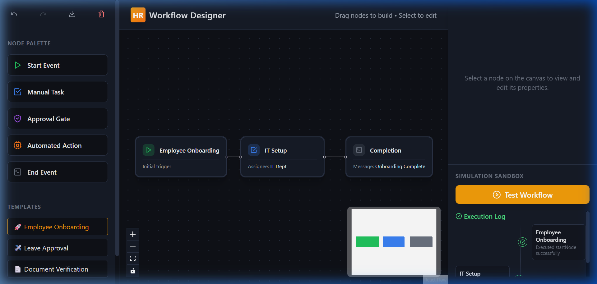
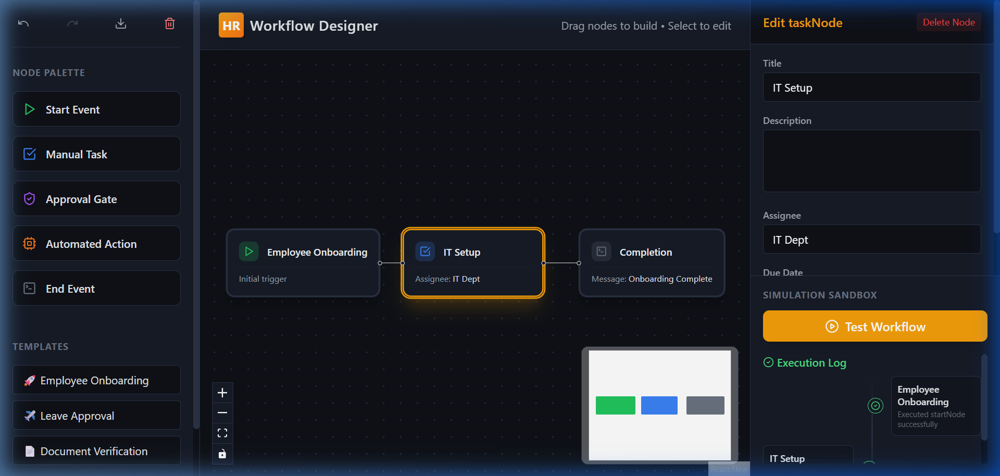
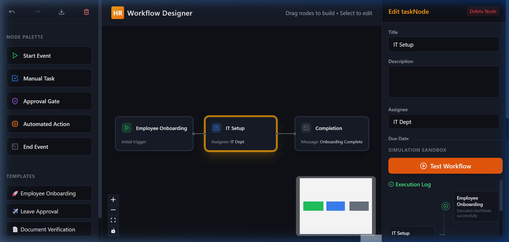
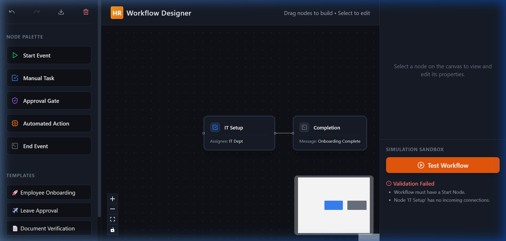

# 🛠️ HR Workflow Designer

[](https://reactjs.org/)
[](https://www.typescriptlang.org/)
[](https://vitejs.dev/)
[](https://tailwindcss.com/)
[](https://opensource.org/licenses/MIT)

A **production-grade visual workflow builder** designed for HR teams to architect, validate, and simulate complex internal processes. From onboarding pipelines to leave approval trees, this tool provides a robust, drag-and-drop interface powered by a high-performance graph engine.

> [!IMPORTANT]
> **Production-Ready Logic**: Unlike simple canvas tools, this designer implements strict DAG (Directed Acyclic Graph) validation and topological execution ordering to ensure workflows are logically sound before deployment.

---

## 🚀 Live Demo
https://Tanikasri.github.io/HR-Workflow-Designer/

---

## ✨ Powerful Features

### 🎨 Visual Process Orchestration
*High-performance canvas architecture for complex HR business logic.*

- **Interactive Node-Graph Environment**: Built with `@xyflow/react`, providing a butter-smooth 60fps experience for large-scale enterprise graphs.
- **Polymorphic Node System**: Five specialized node types tailored for human resources:
  - 🏁 **Start Event**: standardized entry point for every workflow.
  - 📋 **Employee Task**: Manual steps for representatives with assignee assignment.
  - ⚖️ **Approval Gate**: Sophisticated branching logic for manager and finance sign-offs.
  - 🤖 **Automated Hook**: Low-code system-triggered hooks for API integrations.
  - 🛑 **Terminal State**: Formalized end-of-process paths with custom messaging.
- **Intelligent Auto-Layout**: Transform chaotic node placements into professional maps with a single click using the integrated **Dagre DAG algorithm**.

### 🛡️ Institutional Integrity
*The system for teams that can't afford logical errors.*

- **Strict Validation Engine**: Real-time detection of logical fallacies, including **computational cycles**, **isolated nodes**, and **missing terminal states**.
- **Topological Simulation**: Test your logic before deployment. Our engine mimics real-world latency and outcome probabilities with a step-by-step execution log.
- **Real-Time Status Indicators**: Live visual badges and highlight effects provide instant feedback on node configurations and simulation progress.

### 🛠️ Developer & Power-User Suite
*Built for speed, reliability, and portability.*

- **Deep State Persistence**: Full **Undo/Redo** stack and **LocalStorage auto-save** layer ensure zero data loss during high-intensity planning sessions.
- **Universal Serialization**: One-click **JSON Import/Export** to audit, share, or backup workflow configurations across different environments.
- **Global Search & Focus**: Instantly find and focus on specific nodes in massive workflows with built-in search and high-contrast highlighting.
- **Production-Ready Templates**: Bootstrap your HR automation in seconds using pre-built templates for Onboarding, Leave Approvals, and Document Verification.

---

## 💻 Tech Stack

| Category | Technology |
| :--- | :--- |
| **Frontend Core** | React 18, Vite, TypeScript |
| **Graph Engine** | React Flow (@xyflow/react) |
| **State Management** | Zustand |
| **Styling** | Tailwind CSS |
| **Form Logic** | React Hook Form + Zod |
| **API Mocking** | MSW (Mock Service Worker) |
| **Testing** | Vitest (Unit), Cypress (E2E) |
| **Utilities** | Dagre (Layout), Lucide React (Icons) |

---

## 📸 Screenshots

| Workflow Canvas | Node Configuration |
| :---: | :---: |
|  |  |

| Simulation Engine | Validation Logic |
| :---: | :---: |
|  |  |

---

## 🏁 Getting Started

### Prerequisites
*   Node.js (v18.0 or higher)
*   npm or yarn

### Installation
```bash
# Clone the repository
git clone https://github.com/your-username/hr-workflow-designer.git

# Navigate to project directory
cd hr-workflow-designer

# Install dependencies
npm install
```

### Running Locally
```bash
# Start development server
npm run dev

# Run unit tests
npm run test

# Run E2E tests
npm run test:e2e
```

---

## 📂 Project Structure

```text
hr-workflow-designer/
├── src/
│   ├── components/       # UI Components
│   │   ├── canvas/       # React Flow canvas logic
│   │   ├── forms/        # Node configuration forms
│   │   ├── nodes/        # Custom node definitions
│   │   ├── sandbox/      # Simulation execution panel
│   │   └── sidebar/      # Draggable node palette
│   ├── store/            # Zustand global state (Workflow, Simulation)
│   ├── utils/            # Graph algorithms (Dagre, Cycles, BFS)
│   ├── types/            # TypeScript interfaces & types
│   ├── constants/        # Default workflows & configuration
│   └── mocks/            # MSW handlers & data
├── public/               # Static assets
└── tailwind.config.js    # Design system configuration
```

---

## 🏛️ Architecture Highlights

*   **Topological Sorting**: The simulation engine uses Kahn's algorithm or DFS to ensure nodes are executed in the correct linear order.
*   **Declarative Graph State**: Workflow nodes and edges are treated as a single source of truth in Zustand, enabling seamless undo/redo.
*   **Decoupled Mocking**: MSW v2 intercepts network requests for simulation data, allowing the frontend to remain agnostic of the backend implementation.
*   **Zod-Powered Forms**: Every node configuration is strictly validated before being committed to the graph state.

---

## 🎯 Use Cases

*   **Employee Onboarding**: Complex multi-step process including equipment provisioning, paper-work, and team intros.
*   **Leave Management**: Handling approvals across multiple management layers and finance checks.
*   **Internal Automations**: Triggering Slack pings, Jira tickets, or Workday updates via automated system hooks.

---

## 🚀 Future Improvements

*   [ ] Multi-user collaboration via Yjs/WebSockets.
*   [ ] Version control & diffing for workflow changes.
*   [ ] Advanced conditional branching (expression parser).
*   [ ] Export to common BPMN formats.

---

## 📄 License

Distributed under the **MIT License**. See `LICENSE` for more information.

---

## 👤 Author

**Tanikasri**
*   GitHub: [@Tanikasri](https://github.com/Tanikasri)
*   Project Repository: [HR Workflow Designer](https://github.com/Tanikasri/HR-Workflow-Designer)

---
*Created with ❤️ for HR teams everywhere.*
